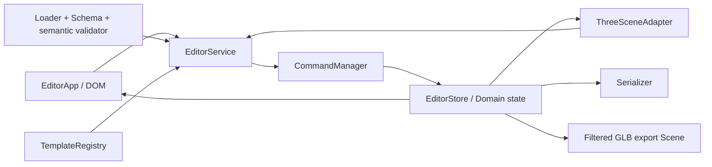

# Forge Studio v0.6-alpha Architecture

## 목표

Domain state를 유일한 영구 편집 원본으로 사용하고 Three.js Object3D와 DOM을 파생 view로 취급한다. 사용자 편집은 `CommandManager`를 통해서만 state에 반영된다. 파일 입력은 validation 완료 전 state를 바꾸지 않는다.

## 모듈 경계

| 계층         | 모듈                                                   | 책임                                                         |
| ------------ | ------------------------------------------------------ | ------------------------------------------------------------ |
| Domain       | `src/domain/*`                                         | object 모델, transform 수학, 계층 조회, bounds, 유효성 규칙  |
| State        | `EditorStore`                                          | 현재 immutable state reference와 구독                        |
| Application  | `EditorService`, `CommandManager`                      | capability, 편집 transaction, Undo/Redo, dirty revision      |
| Template     | `TemplateRegistry`                                     | 20종 정의, Root/Part metadata, data-driven builder           |
| IO           | serializer, loader, validator, migration, GLB exporter | 신뢰 경계, Schema v2, semantic validation, 독립 export Scene |
| View adapter | `ThreeSceneAdapter`, `ObjectViewFactory`               | Domain object에서 Object3D 생성, selection·Gizmo 이벤트 변환 |
| UI           | `EditorApp`                                            | DOM 이벤트, 안전한 `textContent`, Inspector·Hierarchy 렌더   |

Domain과 Application은 DOM 또는 Three.js를 import하지 않는다. `ObjectViewFactory`만 geometry/material을 Three.js 객체로 변환한다.

## 상태와 계층

Project state는 project metadata, settings, flat `objects` 배열, transient selection, transient UI로 구성된다. 계층은 `parentId`로 복원하며 group만 parent가 될 수 있다. 저장 파일에는 selection, camera, panel, history, dirty revision을 포함하지 않는다.

Group/Ungroup은 column-major 4×4 matrix를 조합·역행렬·분해해 새 local transform을 구한다. 다시 조합한 matrix와의 최대 오차가 `1e-6`을 넘으면 transaction을 거부한다.

## Command 정책

각 `SnapshotCommand`는 clone된 before state에 producer를 실행한다. 성공 후에만 history와 store를 갱신하므로 실패는 원자적이다. 최대 100건을 유지하고 새 Command는 redo를 비운다. 같은 `mergeKey`의 입력은 500ms 이내에 합치되 명시적 저장 revision을 넘어 합치지 않는다. 선택과 camera 같은 transient state는 history에 기록하지 않는다.

## IO 신뢰 경계

순서는 확장자 → UTF-8 byte 크기 → JSON parse → version 분기 → migration → 정적 JSON Schema validator → semantic validator다. validator는 빌드 전에 standalone code로 생성돼 CSP에서 `eval` 또는 `new Function`이 필요 없다.

GLB는 editor Scene을 직접 serialize하지 않는다. Domain object로 별도 Scene을 만들고 effective visibility를 적용한 뒤 GLTFExporter에 전달한다.

## 확장

새 템플릿은 `TemplateRegistry` 정의만 추가하면 된다. 새 geometry는 Schema, Domain defaults/triangle/bounds, ObjectViewFactory, migration/fixture를 함께 변경한다. 새 편집 명령은 `EditorService` capability와 독립 Command test를 추가한다.
